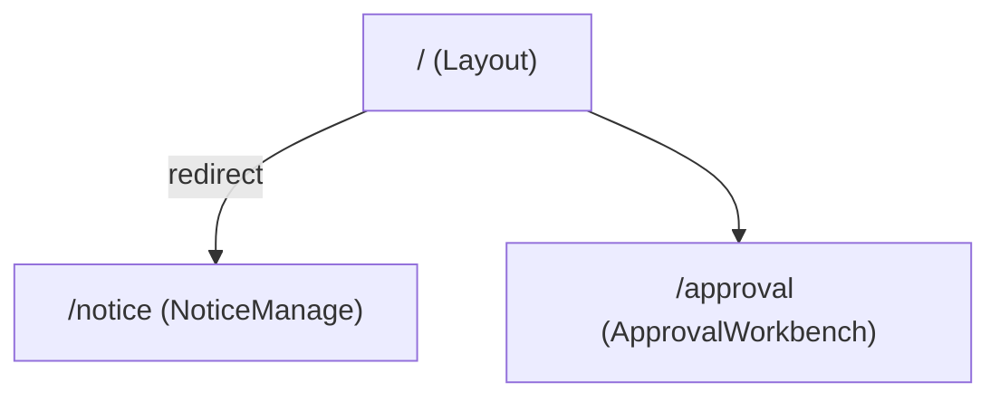
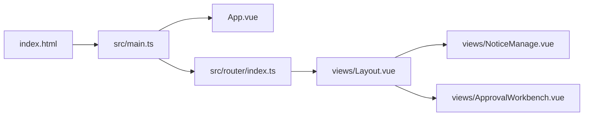

# 01 整体架构

## 分层视角（当前形态）

项目是典型的单页应用（SPA），目前没有独立的“服务层/数据访问层”目录，业务逻辑主要以内聚在页面组件内的事件处理函数形式存在。

- 装配层（Bootstrap）
  - 创建 Vue App、注册插件、挂载 DOM： [main.ts](file:///workspace/admin-pc/src/main.ts#L1-L10)
- 路由层（Navigation）
  - 定义路由树、懒加载页面组件： [router/index.ts](file:///workspace/admin-pc/src/router/index.ts#L1-L28)
- 视图层（Views）
  - Layout 壳 + 页面组件： [views](file:///workspace/admin-pc/src/views)
- UI 组件层（Element Plus）
  - `ElTable / ElDialog / ElForm / ElMessage` 等在页面中直接使用（例如 [NoticeManage.vue](file:///workspace/admin-pc/src/views/NoticeManage.vue#L1-L169)）

## 启动与渲染链路

1. 浏览器加载 Vite HTML 入口： [index.html](file:///workspace/admin-pc/index.html#L1-L13)
2. 入口脚本 `src/main.ts` 创建应用并挂载 `#app`： [main.ts](file:///workspace/admin-pc/src/main.ts#L1-L10)
3. 根组件 `App.vue` 提供顶层 `<router-view />`： [App.vue](file:///workspace/admin-pc/src/App.vue#L1-L3)
4. Router 根据 URL 决定渲染哪个页面：
   - `/` 渲染 `Layout.vue`，并重定向至 `/notice`： [router/index.ts](file:///workspace/admin-pc/src/router/index.ts#L6-L24)
   - Layout 内部再渲染子路由页面： [Layout.vue](file:///workspace/admin-pc/src/views/Layout.vue#L18-L39)

## 路由树（信息架构）

对应实现： [router/index.ts](file:///workspace/admin-pc/src/router/index.ts#L1-L28)

## 组件关系（高层依赖）

## 数据流（以“通知管理”为例）

通知管理页面当前使用前端内存数据：

- `noticeList: Ref<Notice[]>` 作为表格数据源（Mock 初始化）：[NoticeManage.vue:L15-L37](file:///workspace/admin-pc/src/views/NoticeManage.vue#L15-L37)
- 新建/编辑弹窗由 `dialogVisible / dialogTitle / form` 驱动：[NoticeManage.vue:L39-L48](file:///workspace/admin-pc/src/views/NoticeManage.vue#L39-L48)
- 保存与删除通过事件函数直接修改 `noticeList.value` 并弹出消息提示：[NoticeManage.vue:L64-L98](file:///workspace/admin-pc/src/views/NoticeManage.vue#L64-L98)

当前尚未出现：

- API 层（如 `src/api`）、统一请求封装（如 Axios 封装）
- 全局状态管理（如 Pinia/Vuex）
- 领域模型/服务（如 `src/services`）

