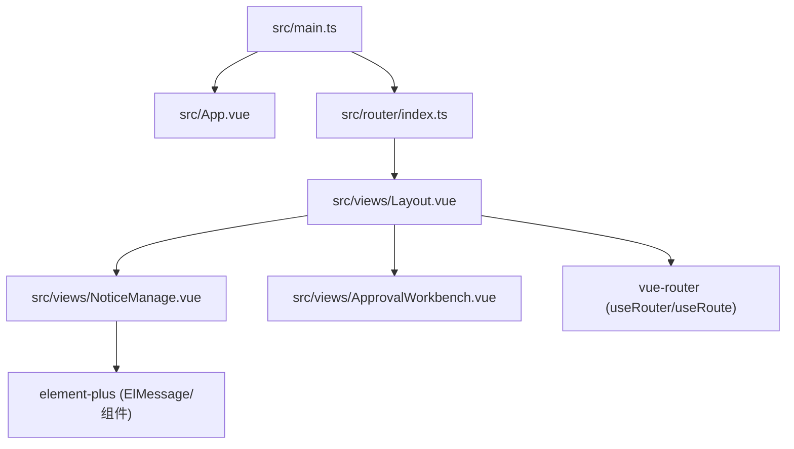

# 04 依赖关系

## NPM 依赖（来自 package.json）

来源： [package.json](file:///workspace/admin-pc/package.json#L1-L24)

### 运行时依赖（dependencies）

- `vue`：核心框架（应用创建、响应式、组件系统）
- `vue-router`：路由与导航
- `element-plus`：UI 组件库（表格、弹窗、表单、按钮、消息提示等）

### 开发依赖（devDependencies）

- `vite`：本地开发服务器与构建打包
- `@vitejs/plugin-vue`：Vite 的 Vue SFC 支持
- `typescript`：TypeScript 编译器
- `vue-tsc`：基于 TS 的 Vue 类型检查（用于 `npm run build` 的前置检查）
- `@vue/tsconfig`：Vue 官方 TSConfig 基线
- `@types/node`：Node 类型定义（用于 Vite 配置等 Node 环境文件）

## 工程配置依赖关系

### Vite 配置

- 配置文件： [vite.config.ts](file:///workspace/admin-pc/vite.config.ts#L1-L7)
- 核心依赖：
  - `defineConfig`（Vite）
  - `@vitejs/plugin-vue`（处理 `.vue` 单文件组件）

### TypeScript 配置拆分

- 根引用聚合： [tsconfig.json](file:///workspace/admin-pc/tsconfig.json#L1-L7)
  - 引用 `tsconfig.app.json`（应用端）
  - 引用 `tsconfig.node.json`（Node/Vite 配置端）
- App 侧： [tsconfig.app.json](file:///workspace/admin-pc/tsconfig.app.json#L1-L14)
  - `extends: @vue/tsconfig/tsconfig.dom.json`
  - `types: ["vite/client"]` 提供 Vite 客户端类型
- Node 侧： [tsconfig.node.json](file:///workspace/admin-pc/tsconfig.node.json#L1-L24)
  - `types: ["node"]`
  - `moduleResolution: "bundler"` 与 Vite/ESM 兼容

## 内部模块依赖（源码级）

## 现状与扩展建议（与依赖相关）

- 当前无 API 客户端依赖与请求封装；若后续接入后端，通常会新增 `src/api` 并引入 HTTP 客户端（需要按团队规范选型）。
- 当前无状态管理依赖；当页面间共享状态增多时再考虑引入全局 store（同样需要按团队规范选型）。

